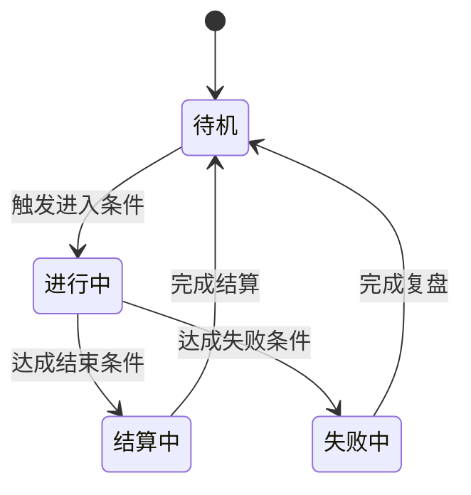

# Standard Templates

Use these templates to reduce output drift and make downstream AI execution more stable.

## 1. 系统规则卡

```markdown
## 3.x 系统 {系统ID}：{系统名}

### 设计目的

### 用户维度

| 项 | 内容 |
|---|---|
| 玩家目标 |  |
| 进入条件 |  |
| 退出条件 |  |
| 核心乐趣 |  |
| 失败代价 |  |
| 复盘收益 |  |

### 关键名词定义

| 名词 | 定义 | 与其他名词边界 |
|---|---|---|
|  |  |  |

### 规则细则

| 规则ID | 触发条件 | 玩家动作 | 系统处理 | 反馈 | 奖励/惩罚 | 备注 |
|---|---|---|---|---|---|---|
| {系统ID}-R01 |  |  |  |  |  |  |

### 边界条件、异常与极端输入

| 场景 | 输入 | 期望结果 | 兜底处理 |
|---|---|---|---|
|  |  |  |  |

### 状态机



### 反滥用与防刷

| 风险 | 触发方式 | 限制手段 | 对正常玩家影响 |
|---|---|---|---|
|  |  |  |  |
```

## 2. 数值公式卡

```markdown
## 6.x 数值公式：{系统ID} / {公式名}

| 项 | 内容 |
|---|---|
| 覆盖系统ID |  |
| 公式ID | FML-01 |
| 公式名称 |  |
| 作用目标 |  |
| 更新频率 |  |

### 公式

`结果 = ...`

### 变量定义

| 变量ID | 变量名 | 含义 | 单位 | 取值范围 | 默认值 | 主要来源 |
|---|---|---|---|---|---|---|
| VAR-01 |  |  |  |  |  |  |

### 边界处理

| 条件 | 处理方式 |
|---|---|
| 下限 |  |
| 上限 |  |
| 截断/四舍五入 |  |
| 溢出 |  |

### 设计意图与体验影响

| 设计意图 | 对玩家体验的影响 |
|---|---|
|  |  |
```

## 3. UI状态矩阵

```markdown
## 4.x UI任务：{系统ID} / {界面名}

| 项 | 内容 |
|---|---|
| 覆盖系统ID |  |
| 关联上游系统 |  |
| 关联下游去向 |  |
| 目标平台 |  |
| 交互设备 |  |

### 主要元素清单

| 元素 | 类型 | 作用 | 是否常驻 |
|---|---|---|---|
|  |  |  |  |

### 状态矩阵

| 元素 | 默认 | 禁用 | 加载中 | 空状态 | 错误 | 成功 | 冷却中 | 首轮引导态 |
|---|---|---|---|---|---|---|---|---|
|  |  |  |  |  |  |  |  |  |

### 交互与去向

| 元素 | 交互方式 | 跳转/结果 | 撤销 | 二次确认 |
|---|---|---|---|---|
|  |  |  |  |  |
```

## 4. 配置字段表

```markdown
## 7.x 配置表：{表名}

| 项 | 内容 |
|---|---|
| 覆盖系统ID |  |
| 表ID | CFG-01 |
| 表名 |  |
| 主键 |  |
| 关联外键 |  |
| 热更支持 | 是/否 |

### 字段定义

| 字段名 | 类型 | 单位 | 取值范围 | 默认值 | 必填 | 唯一性/索引 | 本地化键 | 备注 |
|---|---|---|---|---|---|---|---|---|
|  |  |  |  |  |  |  |  |  |

### 校验规则

| 规则ID | 校验内容 | 失败处理 | 回滚策略 |
|---|---|---|---|
|  |  |  |  |
```

## 5. 风险处置表

```markdown
## 11.x 风险处置：{阶段名或系统ID}

| 风险ID | 风险描述 | 触发阈值 | 影响范围 | 应对动作 | 备选方案 |
|---|---|---|---|---|---|
|  |  |  |  |  |  |
```

## 6. 实施任务回指表

```markdown
## 11.x 实施任务：{阶段名}

| 任务ID | 任务名称 | 回指系统ID | 回指公式ID | 回指表ID | 回指资源ID | 交付物 |
|---|---|---|---|---|---|---|
| TASK-01 |  | SYS-01 | FML-01 | CFG-01 | RES-01 |  |
```

## 7. QA覆盖回指表

```markdown
## 10.x QA覆盖：{阶段名或系统名}

| 用例ID | 用例名称 | 回指系统ID | 回指公式ID | 回指表ID | 覆盖目标 |
|---|---|---|---|---|---|
| QA-01 |  | SYS-01 | FML-01 | CFG-01 |  |
```

## Template policy

- Prefer tables first, prose second.
- If a section is hard to table, use a short paragraph plus a table.
- Do not replace a template with generic explanation.
- Keep template field names stable across iterations.
- When a resource, formula, config table, or variable is named, add it to the corresponding canonical registry.

## 8. 风格锚点模板
```markdown
## x.x 风格锚点：{anchor_id}

| 项目 | 内容 |
|---|---|
| used_by |  |
| visual promise |  |
| primary palette |  |
| accent and warning colors |  |
| value contrast |  |
| line and edge language |  |
| shape language |  |
| perspective |  |
| material feel |  |
| icon rule |  |
| forbidden drift |  |
```

## 9. 资产流水线模板
```markdown
## x.x 资产流水线：{资产族或页面族}

| 资产族 | 当前阶段 | 下一阶段 | 通过门槛 |
|---|---|---|---|
|  | 结构稿 / 风格锁定 / 批量生成 / 清理导出 / 接入验收 |  |  |
```

## 10. 资产验收模板
```markdown
## x.x 资产验收：{资产族或页面族}

| 检查项 | 通过标准 |
|---|---|
| 目标分辨率可读性 |  |
| 样式一致性 |  |
| 集成可用性 |  |
| 命名与导出正确性 |  |
```

## 11. 生成交接模板
```markdown
## x.x 生成交接：{资产族或页面族}

| 项目 | 内容 |
|---|---|
| tool type | AI coding / AI UI / AI image / AI audio |
| current stage |  |
| anchor_id |  |
| input scope |  |
| required return fields |  |
| rejection conditions |  |
```

## 12. 资产登记表模板
```markdown
## x.x 资产登记表

| asset_id | family_id | related_system_ids | anchor_id | current_stage | intended_tool | intended_use | export_spec | acceptance_status | replacement_of |
|---|---|---|---|---|---|---|---|---|---|
| AST-UI-001 | UI-PAGE | SYS-01 | ANCHOR-UI-01 | draft | AI UI | 洗浴主界面结构稿 | 1280x720 PNG | pending | 无 |
```

## 13. 工具选择矩阵模板
```markdown
## x.x 工具选择矩阵：{资产族}

| 项目 | 内容 |
|---|---|
| asset_family |  |
| target_stage |  |
| preferred_tool |  |
| fallback_tool |  |
| placeholder_backup |  |
| choice_reason |  |
| evidence_source |  |
| switch_condition |  |
| output_expectation |  |
```
